# Operationalizing-AWS-ML-Project

## Training and deployment

For this training and deployment, ml.t3.medium instance is created as it is included in the free tier and the we are just using it to run the notebook as the training will be on the much powerfull instance. We do not need much computational power while running the notebook so i believe this is the best economical and effiencent instance.

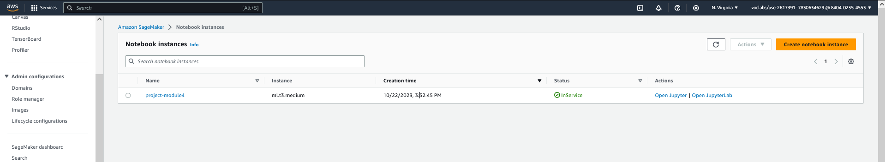

Data is downloaded into the created bucket as below:

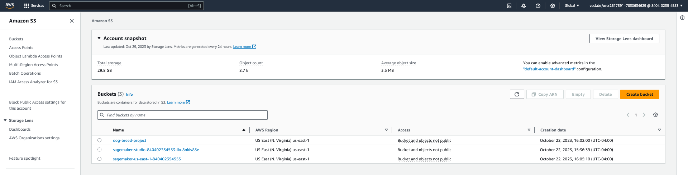

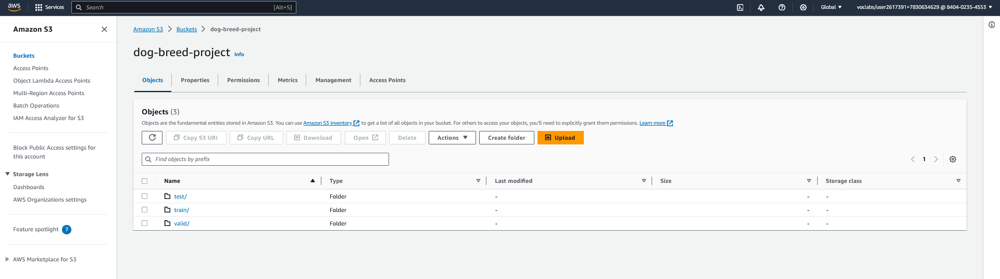

Below is the snap of the deployed endpoint from the inference. Two endpoints are deployed, one with single instance and one with multi instance

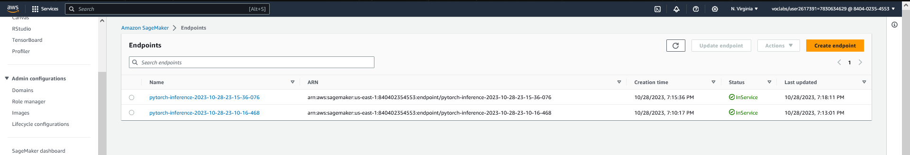

## Training and deployment using EC2

In this case we have used t3.2xlarge instance which is more powerful as the model will be trained on this instance unlike the notebook. We need a good high power instance to be able to finish the training job in an acceptable timeframe. 

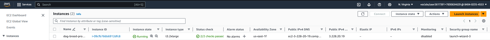

 Below is the output of the output of the training from the EC2

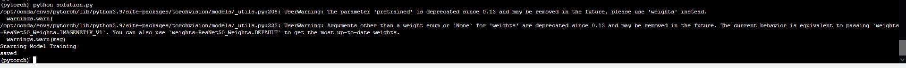

 ## Lambda function setup and security

 Below is the lambda function setup giving IAM access to the role and deploying the python file. As seen below, two policies are attched to make sure the Lambda runs properly and also able to access Sagemaker endpoints for the requests. Adding the FullAccess will give other access to the Lambda which is not required for this application so we can narrow it down to just access the endpoint for this exercise.

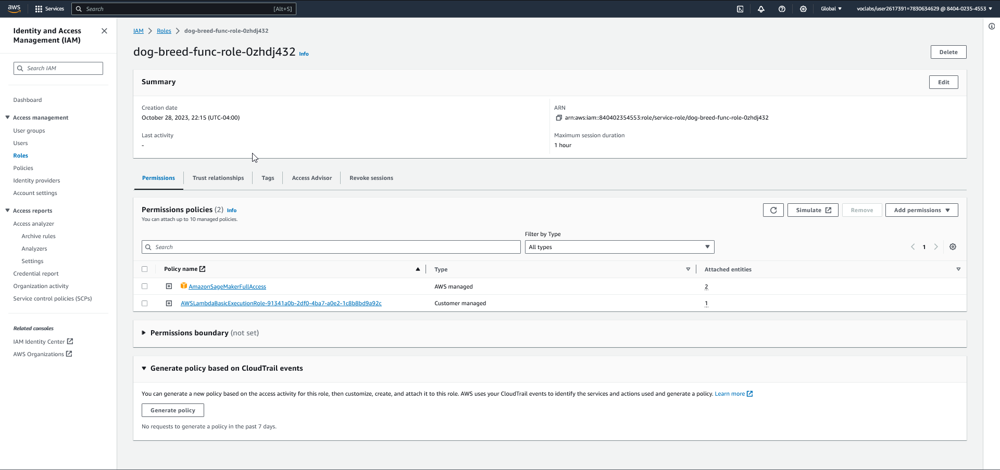

 Below is the output from when testing the lambda function

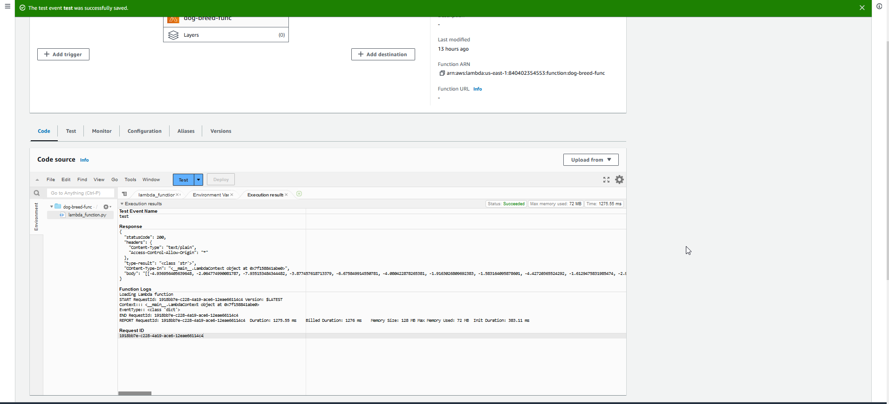

 ## Concurrency

 We have reserved 2 Provisional concurreny for this lambda. This type would good for our requirement as it would not generate high cost but also keep ensure 2 lambda can be invoked at the same time.

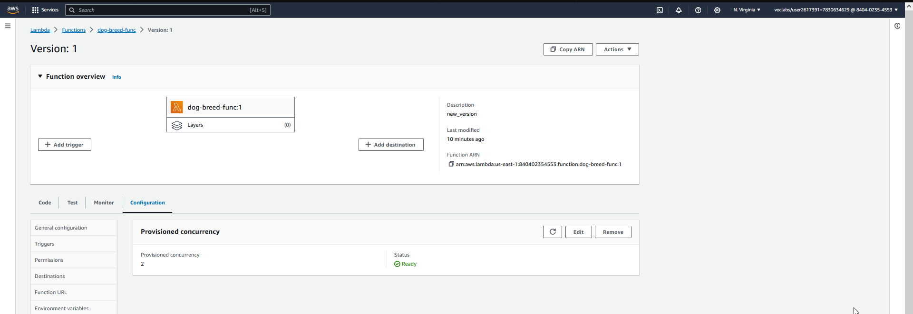

 We have also set up autoscaling for our endpoint in Sagemaker. We have set 3 instance with the cool down period of 30 second for both scale in and scale down. This helps with low latency and also help with cost as if there are no request, it will be off after 30 seconds. 

 Below is the snap of the autoscaling paramters.

 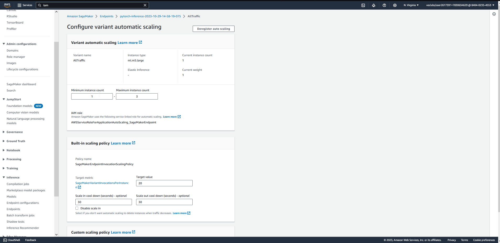

 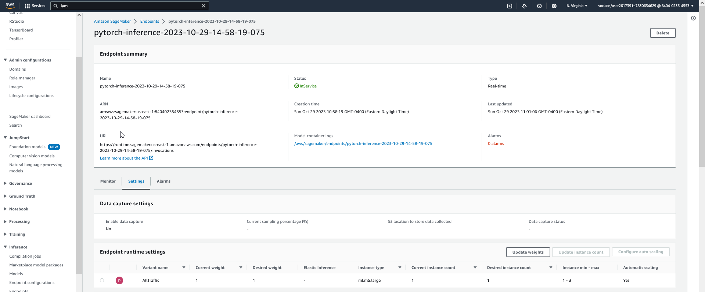
